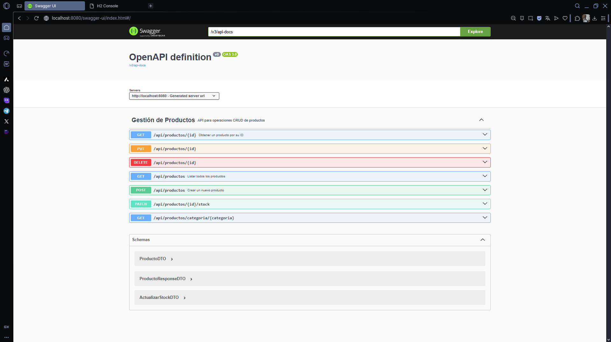
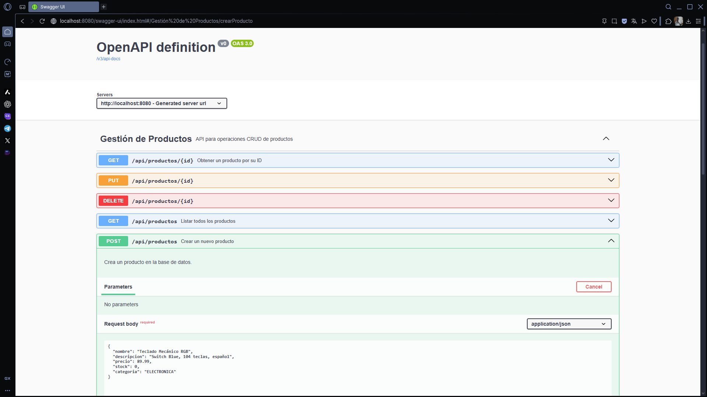
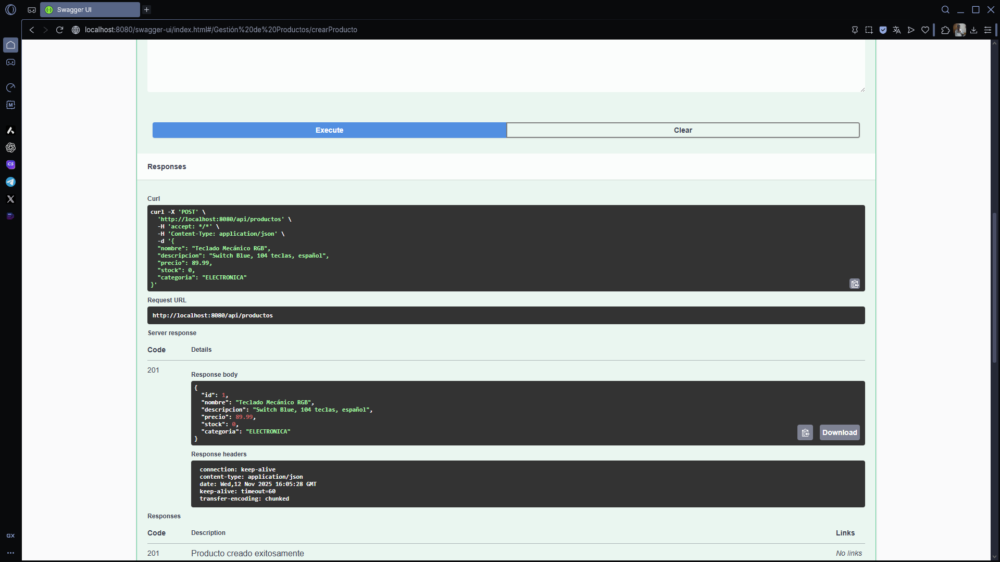
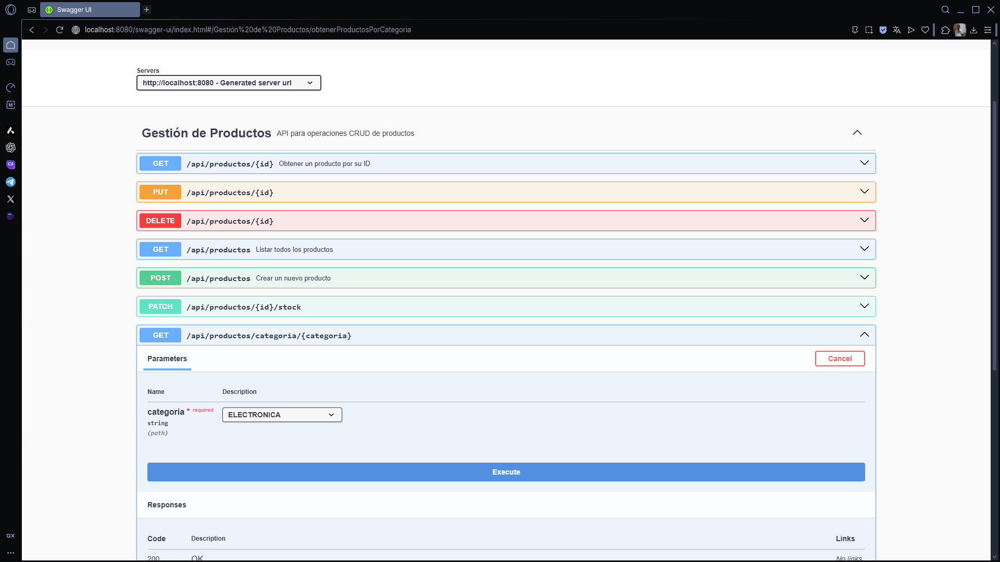
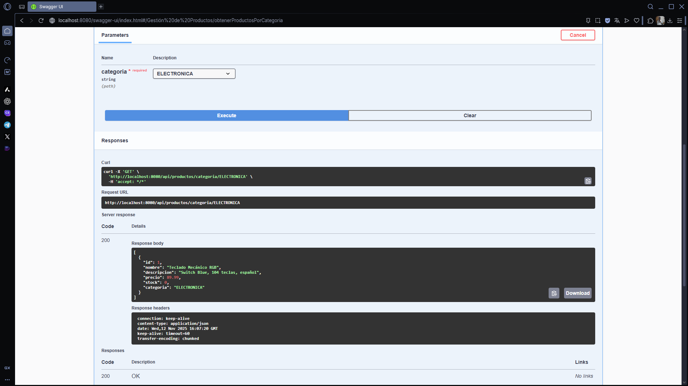
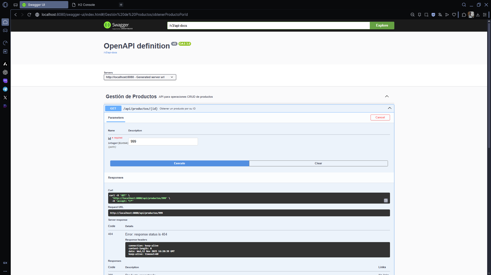
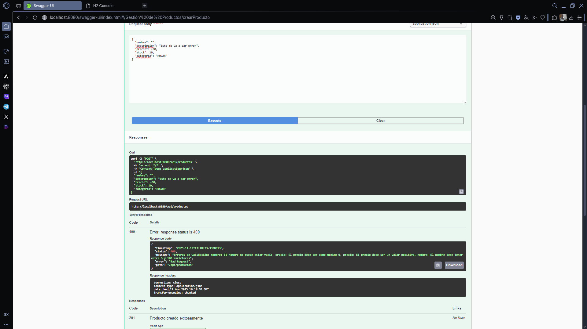
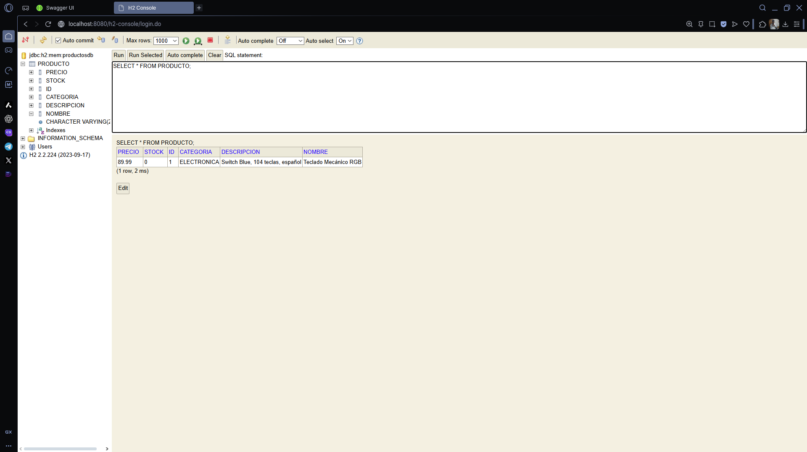

# API REST de Gestión de Productos - Spring Boot

Este proyecto es un Trabajo Práctico (TP) para la materia **Programación III** de la **Tecnicatura Universitaria en Programación de la UTN**.

## Descripción del Proyecto y Funcionalidad

El objetivo es desarrollar una API REST completa para la gestión de productos de un e-commerce básico. La API permite realizar operaciones CRUD (Crear, Leer, Actualizar, Eliminar) sobre una entidad `Producto`.

La arquitectura sigue un diseño profesional en capas:
* **Capa de Controlador (Controller):** Expone los endpoints REST.
* **Capa de Servicio (Service):** Contiene toda la lógica de negocio.
* **Capa de Repositorio (Repository):** Se encarga de la comunicación con la base de datos (persistencia).
* **DTOs:** Se utilizan para la transferencia de datos, desacoplando el modelo de la API del modelo de la base de datos.

## 🚀 Tecnologías Utilizadas

* **Java 17**
* **Spring Boot 3.x**
* **Spring Web:** Para la creación de controladores REST.
* **Spring Data JPA:** Para la persistencia de datos.
* **H2 Database:** Base de datos en memoria para desarrollo y pruebas.
* **Lombok:** Para reducir código repetitivo (getters, setters, etc.).
* **Spring Validation:** Para la validación de DTOs de entrada.
* **Springdoc OpenAPI (Swagger):** Para la documentación interactiva de la API.
* **Gradle:** Como gestor de dependencias.

## 📋 Instrucciones para Clonar y Ejecutar

1.  **Clonar el repositorio:**
    ```bash
    git clone [[URL-DE-TU-REPOSITORIO-GITHUB]](https://github.com/ldslm1101-art/productos-api-rest/tree/0e416723d53d0157ffa61135369b38e9335dff0c)
    cd producto-api
    ```

2.  **Ejecutar el proyecto:**
    * **Desde un IDE (Recomendado):** Importa el proyecto (como proyecto de Gradle) en IntelliJ IDEA o VSCode y ejecuta la clase principal `ProductoApiApplication.java`.
    * **Desde la terminal (con Gradle):**
        ```bash
        ./gradlew bootRun
        ```

## 🛠️ Tabla de Endpoints

La API expone los siguientes endpoints, con la ruta base `/api/productos`:

| Método | Ruta | Descripción |
| :--- | :--- | :--- |
| `POST` | `/api/productos` | Crea un nuevo producto. |
| `GET` | `/api/productos` | Lista todos los productos. |
| `GET` | `/api/productos/{id}` | Obtiene un producto por su ID. |
| `GET` | `/api/productos/categoria/{categoria}` | Filtra productos por categoría. |
| `PUT` | `/api/productos/{id}` | Actualiza un producto completo por su ID. |
| `PATCH` | `/api/productos/{id}/stock` | Actualiza solo el stock de un producto. |
| `DELETE` | `/api/productos/{id}` | Elimina un producto por su ID. |

---

## 🖥️ Acceso a Herramientas

Una vez que la aplicación esté en ejecución, puedes acceder a:

* **Swagger UI (Documentación API):**
    * **URL:** `http://localhost:8080/swagger-ui/index.html`

* **Consola H2 (Base de Datos):**
    * **URL:** `http://localhost:8080/h2-console`
    * **JDBC URL:** `jdbc:h2:mem:productosdb`
    * **Username:** `sa`
    * **Password:** (dejar en blanco)

---

## 📸 Capturas de Pantalla

A continuación, se demuestran las pruebas y el funcionamiento de la API:

### Documentación Completa en Swagger UI


### Prueba Exitosa de POST (Creando producto)



### Prueba de GET (Listando productos)



### Error 404 (Producto no existe)


### Error 400 (Validación fallida)


### Consola H2 con Datos Persistidos

Autor: Lautaro Montenegro
Legajo: 51208
mail: lds.lm1101@gmail.com
